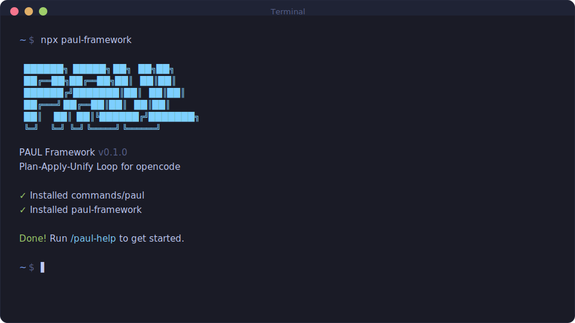

<div align="center">

# PAUL Framework

**Plan-Apply-Unify Loop** — Structured AI-assisted development for Claude Code.

[](https://www.npmjs.com/package/paul-framework)
[](LICENSE)
[](https://github.com/ChristopherKahler/paul)

<br>

```bash
npx paul-framework
```

**Works on Mac, Windows, and Linux.**

<br>



<br>

*"Quality over speed-for-speed's-sake. In-session context over subagent sprawl."*

<br>

[Why PAUL](#why-paul) · [Getting Started](#getting-started) · [The Loop](#the-loop) · [Commands](#commands) · [How It Works](#how-it-works)

</div>

---

## Why PAUL

I build with Claude Code every day. It's incredibly powerful — when you give it the right context.

The problem? **Context rot.** As your session fills up, quality degrades. Subagents spawn with fresh context but return ~70% quality work that needs cleanup. Plans get created but never closed. State drifts. You end up debugging AI output instead of shipping features.

PAUL fixes this with three principles:

1. **Loop integrity** — Every plan closes with UNIFY. No orphan plans. UNIFY reconciles what was planned vs what happened, updates state, logs decisions. This is the heartbeat.

2. **In-session context** — Subagents are expensive and produce lower quality for implementation work. PAUL keeps development in-session with properly managed context. Subagents are reserved for discovery and research — their job IS to gather context.

3. **Acceptance-driven development** — Acceptance criteria are first-class citizens, not afterthoughts. Define done before starting. Every task references its AC. BDD format: `Given [precondition] / When [action] / Then [outcome]`.

The complexity is in the system, not your workflow. Behind the scenes: structured state management, XML task formatting, loop enforcement. What you see: a few commands that keep you on track.

---

## Who This Is For

**AI-assisted developers** who want structure without bureaucracy.

You describe what you want, Claude Code builds it, and PAUL ensures:
- Plans have clear acceptance criteria
- Execution stays bounded
- Every unit of work gets closed properly
- State persists across sessions
- Decisions are logged for future reference

No sprint ceremonies. No story points. No enterprise theater. Just a system that keeps AI-assisted development reliable.

---

## Getting Started

```bash
npx paul-framework
```

The installer prompts you to choose:
1. **Location** — Global (all projects) or local (current project only)

Verify with `/paul:help` inside Claude Code.

### Quick Workflow

```bash
# 1. Initialize PAUL in your project
/paul:init

# 2. Create a plan for your work
/paul:plan

# 3. Execute the approved plan
/paul:apply

# 4. Close the loop (required!)
/paul:unify

# 5. Check progress anytime
/paul:progress
```

### Staying Updated

```bash
npx paul-framework@latest
```

<details>
<summary><strong>Non-interactive Install</strong></summary>

```bash
npx paul-framework --global   # Install to ~/.claude/
npx paul-framework --local    # Install to ./.claude/
```

</details>

---

## The Loop

Every unit of work follows this cycle:

```
┌─────────────────────────────────────┐
│  PLAN ──▶ APPLY ──▶ UNIFY          │
│                                     │
│  Define    Execute    Reconcile     │
│  work      tasks      & close       │
└─────────────────────────────────────┘
```

### PLAN

Create an executable plan with:
- **Objective** — What you're building and why
- **Acceptance Criteria** — Given/When/Then definitions of done
- **Tasks** — Specific actions with files, verification, done criteria
- **Boundaries** — What NOT to change

### APPLY

Execute the approved plan:
- Tasks run sequentially
- Each task has verification
- Checkpoints pause for human input when needed
- Deviations are logged

### UNIFY

Close the loop (required!):
- Create SUMMARY.md documenting what was built
- Compare plan vs actual
- Record decisions and deferred issues
- Update STATE.md

**Never skip UNIFY.** Every plan needs closure. This is what separates structured development from chaos.

---

## Commands

PAUL provides 26 commands organized by purpose. Run `/paul:help` for the complete reference.

### Core Loop

| Command | What it does |
|---------|--------------|
| `/paul:init` | Initialize PAUL in a project |
| `/paul:plan [phase]` | Create an executable plan |
| `/paul:apply [path]` | Execute an approved plan |
| `/paul:unify [path]` | Reconcile and close the loop |
| `/paul:help` | Show command reference |
| `/paul:status` | Show loop position *(deprecated — use progress)* |

### Session

| Command | What it does |
|---------|--------------|
| `/paul:pause [reason]` | Create handoff for session break |
| `/paul:resume [path]` | Restore context and continue |
| `/paul:progress [context]` | Smart status + ONE next action |
| `/paul:handoff [context]` | Generate comprehensive handoff |

### Roadmap

| Command | What it does |
|---------|--------------|
| `/paul:add-phase <desc>` | Append phase to roadmap |
| `/paul:remove-phase <N>` | Remove future phase |

### Milestone

| Command | What it does |
|---------|--------------|
| `/paul:milestone <name>` | Create new milestone |
| `/paul:complete-milestone` | Archive and tag milestone |
| `/paul:discuss-milestone` | Articulate vision before starting |

### Pre-Planning

| Command | What it does |
|---------|--------------|
| `/paul:discuss <phase>` | Capture decisions before planning |
| `/paul:assumptions <phase>` | See Claude's intended approach |
| `/paul:discover <topic>` | Explore options before planning |
| `/paul:consider-issues` | Triage deferred issues |

### Research

| Command | What it does |
|---------|--------------|
| `/paul:research <topic>` | Deploy research agents |
| `/paul:research-phase <N>` | Research unknowns for a phase |

### Specialized

| Command | What it does |
|---------|--------------|
| `/paul:flows` | Configure skill requirements |
| `/paul:config` | View/modify PAUL settings |
| `/paul:map-codebase` | Generate codebase overview |

### Quality

| Command | What it does |
|---------|--------------|
| `/paul:verify` | Guide manual acceptance testing |
| `/paul:plan-fix` | Plan fixes for UAT issues |

---

## How It Works

### Project Structure

```
.paul/
├── PROJECT.md           # Project context and requirements
├── ROADMAP.md           # Phase breakdown and milestones
├── STATE.md             # Loop position and session state
├── config.md            # Optional integrations
├── SPECIAL-FLOWS.md     # Optional skill requirements
└── phases/
    ├── 01-foundation/
    │   ├── 01-01-PLAN.md
    │   └── 01-01-SUMMARY.md
    └── 02-features/
        ├── 02-01-PLAN.md
        └── 02-01-SUMMARY.md
```

### State Management

**STATE.md** tracks:
- Current phase and plan
- Loop position (PLAN/APPLY/UNIFY markers)
- Session continuity (where you stopped, what's next)
- Accumulated decisions
- Blockers and deferred issues

When you resume work, `/paul:resume` reads STATE.md and suggests exactly ONE next action. No decision fatigue.

### PLAN.md Structure

```markdown
---
phase: 01-foundation
plan: 01
type: execute
autonomous: true
---

<objective>
Goal, Purpose, Output
</objective>

<context>
@-references to relevant files
</context>

<acceptance_criteria>
## AC-1: Feature Works
Given [precondition]
When [action]
Then [outcome]
</acceptance_criteria>

<tasks>
<task type="auto">
  <name>Create login endpoint</name>
  <files>src/api/auth/login.ts</files>
  <action>Implementation details...</action>
  <verify>curl command returns 200</verify>
  <done>AC-1 satisfied</done>
</task>
</tasks>

<boundaries>
## DO NOT CHANGE
- database/migrations/*
- src/lib/auth.ts
</boundaries>
```

Every task has: files, action, verify, done. If you can't specify all four, the task is too vague.

### CARL Integration

PAUL has a companion: **[CARL](https://github.com/ChristopherKahler/carl-core)** (Context Augmentation & Reinforcement Layer).

CARL is a dynamic rule injection system. Instead of bloating your context with static prompts, CARL loads rules just-in-time based on what you're doing:

| Trigger | Rules Loaded |
|---------|--------------|
| Working in `.paul/` directory | PAUL domain activates |
| Writing code | DEVELOPMENT rules load |
| Managing projects | PROJECTS rules load |

**PAUL-specific rules CARL enforces:**
- Loop enforcement (PLAN → APPLY → UNIFY — no shortcuts)
- Boundary protection (DO NOT CHANGE sections are real)
- State consistency checks at phase transitions
- Verification requirements for every task
- Skill blocking (required skills must load before APPLY)

The PAUL domain contains 14 rules that govern structured AI development. They load when you're in a PAUL project, disappear when you're not. Your context stays lean.

**Without CARL:** You'd need massive static prompts in every session.
**With CARL:** Rules activate when relevant, disappear when not.

---

## Philosophy

### Acceptance-Driven Development (A.D.D.)

Acceptance criteria aren't afterthoughts — they're the foundation:

1. **AC defined before tasks** — Know what "done" means
2. **Tasks reference AC** — Every task links to AC-1, AC-2, etc.
3. **Verification required** — Every task needs a verify step
4. **BDD format** — Given/When/Then for testability

### In-Session Context

Why PAUL minimizes subagents for development work:

| Issue | Impact |
|-------|--------|
| Launch cost | 2,000-3,000 tokens to spawn |
| Context gathering | Starts fresh, researches from scratch |
| Resynthesis | Results must be integrated back |
| Quality gap | ~70% compared to in-session work |
| Rework | Subagent output often needs cleanup |

**When PAUL does use subagents:**
- **Discovery/exploration** — Codebase mapping, parallel exploration
- **Research** — Web searches, documentation gathering

For implementation, PAUL keeps everything in-session with proper context management.

### Loop Integrity

The loop isn't optional:

```
PLAN ──▶ APPLY ──▶ UNIFY
  ✓        ✓        ✓     [Loop complete]
```

- **No orphan plans** — Every PLAN gets a SUMMARY
- **State reconciliation** — UNIFY catches drift
- **Decision logging** — Choices are recorded for future sessions

---

## Configuration

### Optional Integrations

PAUL supports modular integrations configured in `.paul/config.md`:

| Integration | Purpose |
|-------------|---------|
| SonarQube | Code quality metrics and issues |
| *Future* | Linting, CI/CD, test runners |

### SPECIAL-FLOWS

For projects with specialized requirements, `.paul/SPECIAL-FLOWS.md` defines skills that must be loaded before execution:

```markdown
## Required Skills

| Skill | Work Type | Priority |
|-------|-----------|----------|
| /frontend-design | UI components | required |
| /revops-expert | Landing pages | required |
```

APPLY blocks until required skills are confirmed loaded.

---

## Troubleshooting

**Commands not found after install?**
- Restart Claude Code to reload slash commands
- Verify files exist in `~/.claude/commands/paul/` (global) or `./.claude/commands/paul/` (local)

**Commands not working as expected?**
- Run `/paul:help` to verify installation
- Re-run `npx paul-framework` to reinstall

**Loop position seems wrong?**
- Check `.paul/STATE.md` for current state
- Run `/paul:progress` for guided next action

**Resuming after a break?**
- Run `/paul:resume` — it reads state and handoffs automatically

---

## Comparison

### vs. Ad-hoc AI Coding

| Ad-hoc | PAUL |
|--------|------|
| No structure | Explicit planning gates |
| State drifts | STATE.md tracks everything |
| No closure | Mandatory UNIFY |
| Decisions lost | Decisions logged |

### vs. GSD

PAUL takes a different approach from GSD:

| Aspect | GSD | PAUL |
|--------|-----|------|
| Execution | Parallel subagents | In-session context |
| Loop | Optional closure | Mandatory UNIFY |
| Criteria | Embedded in tasks | First-class AC section |
| Rules | Static prompts | CARL dynamic loading |

Same comprehensive coverage, different philosophy. PAUL prioritizes quality over speed-for-speed's-sake. See [PAUL-VS-GSD.md](PAUL-VS-GSD.md) for full comparison.

### vs. Traditional Planning

| Traditional | PAUL |
|-------------|------|
| Documentation-first | Execution-first |
| Human-readable specs | AI-executable prompts |
| Separate from code | Colocated in .paul/ |

---

## License

MIT License. See [LICENSE](LICENSE) for details.

---

## Author

**Chris Kahler** — [Chris AI Systems](https://github.com/ChristopherKahler)

Building tools for AI-assisted development.

---

<div align="center">

**Claude Code is powerful. PAUL makes it reliable.**

</div>
